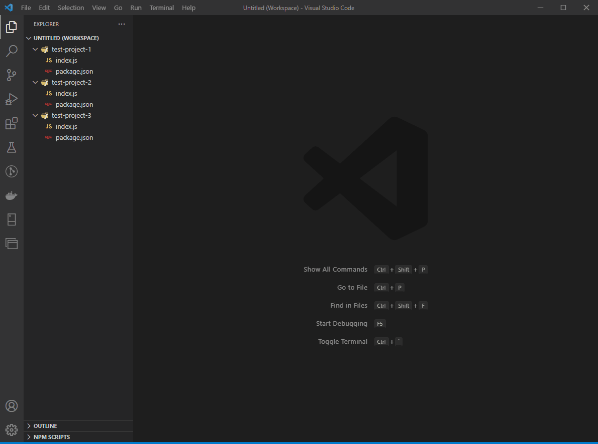
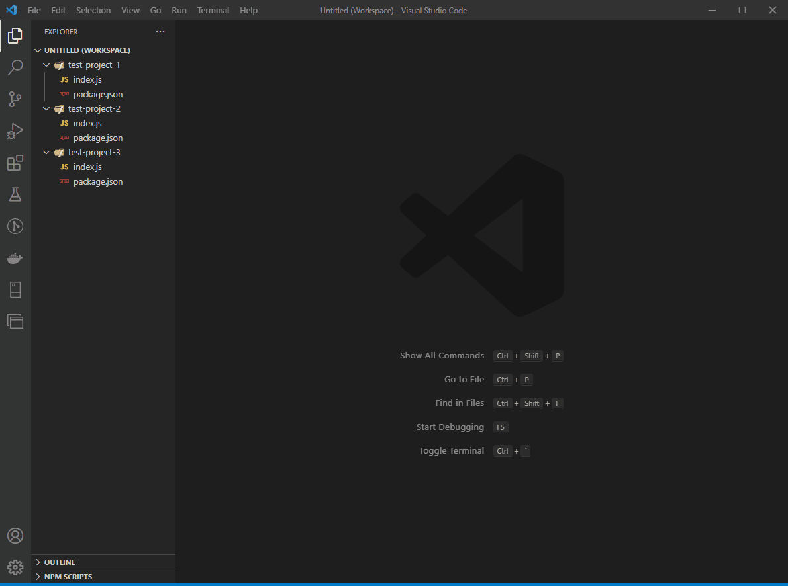
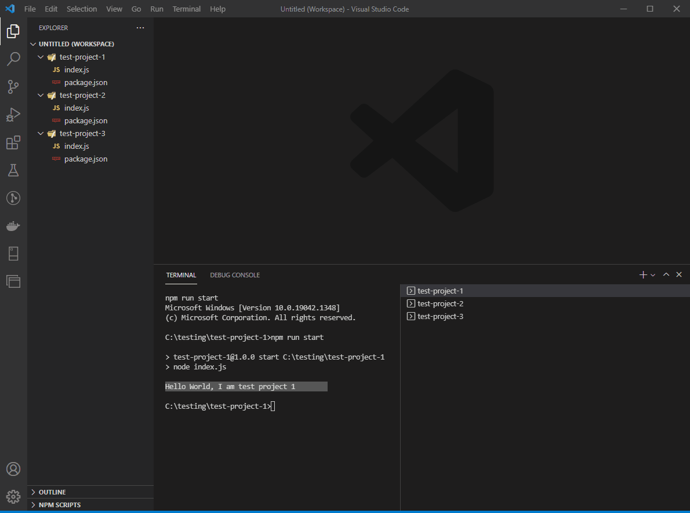

# workspace-terminal

Open terminals automatically for all folders in workspace. Terminals can also be opened with a command. 

  

## Features

  

#### `Open:` Open separate terminals for each folder in the workspace. The terminal names are the folder names.

  

### `Open with a command:` Open separate terminals for each folder in the workspace and run a command in each terminal. The terminal names are the folder names.
Enter the command that needs to be run after terminal opens. For example `npm run start` or chain commands `npm i && npm run start`.

  

### `Close all:` Close all the terminals.

## Release Notes

### 0.0.1
 
Added context menu for opening and closing terminals.